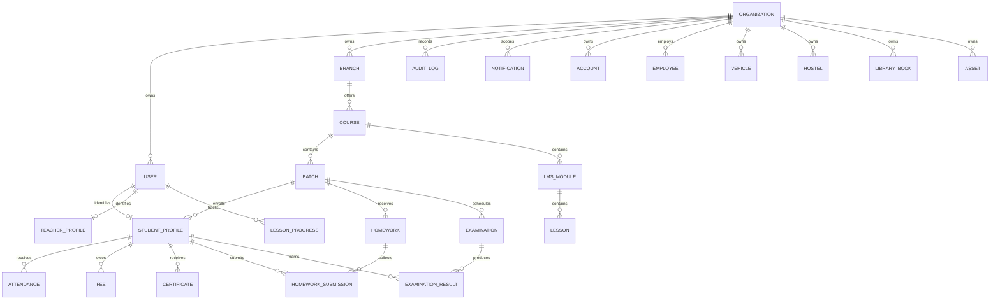

# Database ER diagram

The complete Prisma schema is the authoritative field-level reference. This diagram captures the principal ownership and operational relationships.

Every tenant-scoped table includes `organizationId`; compound uniqueness and lookup indexes enforce tenant isolation and query locality.

